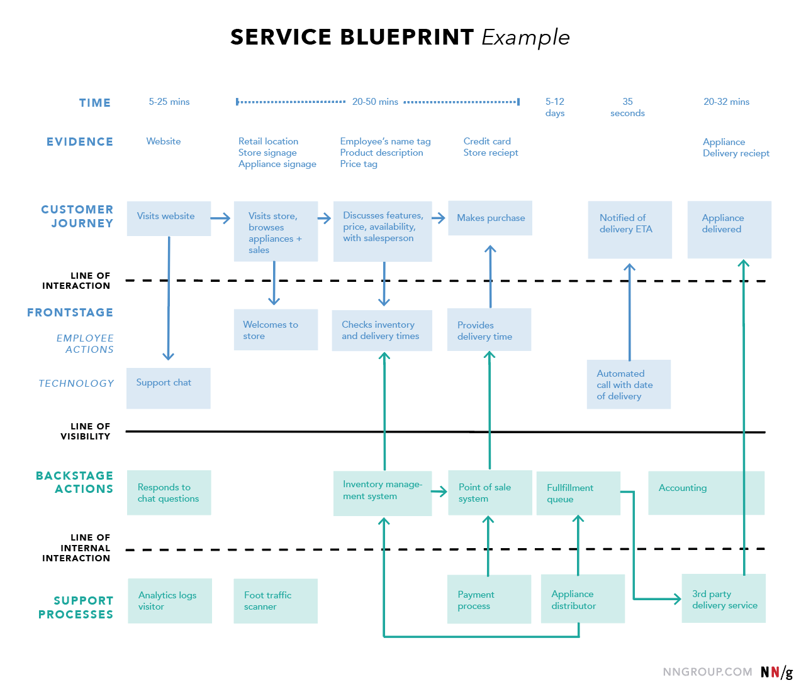

# Lean-UX
Lean UX é ideal para ambientes ágeis, startups ou qualquer equipe que deseje entregar valor rapidamente, focando na experiência real do usuário. Também pode ser implementado em empresas maiores que buscam melhorar a eficiência e inovação no design de produtos.

# Estratégia de Produtos: Métodos e Ferramentas

Esta seção apresenta uma série de métodos e ferramentas estratégicas que ajudam a desenvolver produtos com foco no usuário e no mercado, alinhadas com os princípios do Lean UX. Elas facilitam a comunicação da visão do produto, a tomada de decisões e a validação contínua.

# 1. Blueprints (Service Blueprinting)
   - Um mapeamento visual que detalha o processo completo de um serviço, abrangendo as interações do usuário, atividades internas e pontos de contato. Ajuda a identificar oportunidades de melhoria e otimização do fluxo de serviço.
   https://www.nngroup.com/articles/service-blueprints-definition/
   

# 2. Mapa de Jornada do Usuário (User Journey Map)
   - Diagrama que ilustra a experiência do usuário ao interagir com o produto, desde o início até a conclusão. Detalha pontos de contato, emoções e desafios, ajudando a criar uma experiência mais fluida e satisfatória.

# 3. Ecossistema
   - Representa todos os elementos, sistemas e atores envolvidos que interagem com o produto. Ajuda a entender como o produto se encaixa no contexto maior e a identificar oportunidades de integração e crescimento.

# 4. Golden Path
   - Define o caminho ideal que o usuário deve seguir ao usar o produto. Foca nas interações que geram o maior valor, priorizando funcionalidades chave para otimizar a experiência do usuário.

# 5. Future Press Release
   - Técnica que consiste em escrever um comunicado de imprensa fictício, imaginando o sucesso futuro do produto. Esse exercício ajuda a definir a visão, benefícios e diferenciais do produto de forma clara.

# 6. Pixar Storytelling
   - Uma abordagem de narrativa inspirada na estrutura clássica da Pixar, usada para contar a história do produto de forma envolvente. Ajuda a comunicar a visão e o propósito de maneira cativante.

# 7. Personas
   - Personagens fictícios criados a partir de pesquisas que representam os usuários típicos do produto. Auxiliam na tomada de decisões de design, mantendo o foco nas necessidades reais do público-alvo.

# 8. Mapa de Stakeholders
   - Diagrama que identifica todos os stakeholders (internos e externos) que influenciam ou são impactados pelo produto. Facilita a gestão de expectativas e o alinhamento entre diferentes partes interessadas.

# 9. Proposta de Valor
   - Define o diferencial do produto, explicando por que o usuário deveria escolhê-lo. Destaca os benefícios únicos oferecidos e como o produto resolve os problemas ou atende às necessidades do público-alvo.

# 10. Business Model Canvas
    - Ferramenta visual que descreve o modelo de negócios do produto, incluindo proposta de valor, segmentos de clientes, canais de distribuição, estrutura de custos e fontes de receita. Útil para testar e ajustar hipóteses estratégicas.

# 11. Canvas de Proposta de Valor
    - Expande o Business Model Canvas ao detalhar como o produto atende às necessidades dos clientes e resolve seus problemas. Focado em especificar o valor entregue ao público-alvo.

# 12. Primeiro Tweet
    - Técnica de comunicação que simula um tweet anunciando o produto. Ajuda a sintetizar a proposta de valor em uma mensagem breve e impactante.

# 13. 360 Lightning Talk
    - Apresentação rápida (5 minutos) que comunica a visão, o valor e os principais aspectos do produto. Excelente para engajar stakeholders e alinhar equipes sobre a estratégia do produto.

# 14. Benchmark
    - Análise comparativa com produtos concorrentes para identificar melhores práticas e oportunidades de diferenciação. Importante para definir o posicionamento e metas de performance.

# 15. Métricas (Visão Geral)
    - Indicadores que medem o sucesso do produto em termos de adoção, retenção, satisfação do usuário e impacto nos negócios. Essenciais para orientar ajustes estratégicos e validar o progresso do produto.

